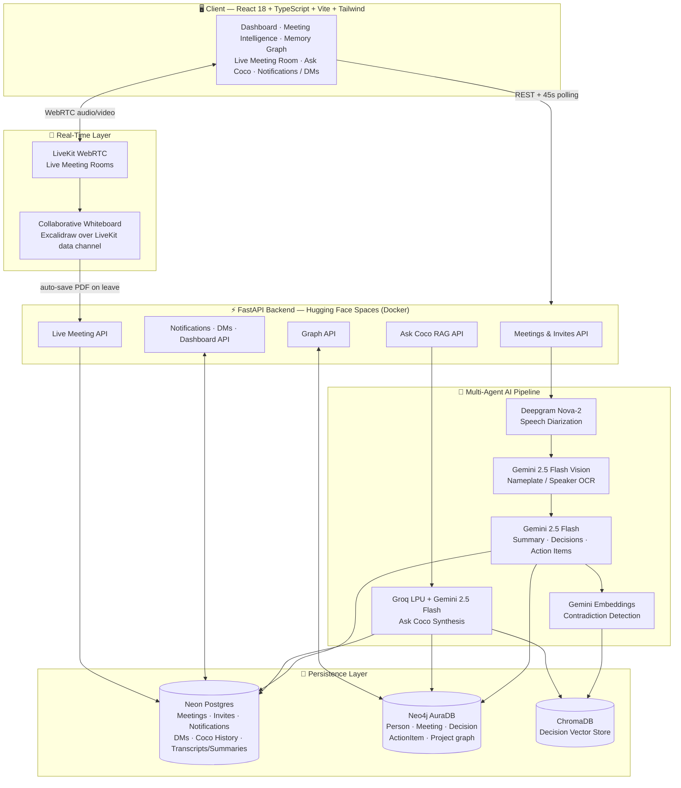

# 🧠 Corporate Brain

### Enterprise Meeting Intelligence & Organizational Memory Graph Platform

<p>
Turns raw meetings — recorded uploads or live WebRTC calls — into a searchable,
self-updating organizational knowledge graph. Captures not just <em>what</em>
was decided, but <em>who</em> decided it, <em>why</em>, and whether it
contradicts something decided weeks ago.
</p>

<p>
  <a href="https://corporate-brain-1.vercel.app"></a>
  <a href="https://ninjayy-corporate-brain-backend.hf.space/docs"></a>
  <a href="https://github.com/yapyap06/corporate_brain"></a>
  <a href="https://neo4j.com/product/auradb/"></a>
  <a href="https://neon.tech"></a>
</p>

**Team Teh O Ais · APU Fintech Hackathon · Track 3: Intelligent Meeting Capture**

---

## 🏗️ System Architecture & Multi-Agent AI Flow



**Person-rename propagation** (Memory Graph → everywhere): renaming a `Person`
node in the graph cascades into every stored meeting's decision speakers,
transcript speaker labels, and action-item assignees, so the Dashboard's
*"My Action Tasks"* keeps matching the renamed employee — no orphaned records.

---

## ✨ Key Features & Enhancements

### 1. 🧠 Meeting Intelligence Engine
- Upload a recording (`.mp4/.mov/.wav/.mp3`) **or** run a live WebRTC session — both feed the same AI pipeline.
- Deepgram Nova-2 diarization → Gemini Vision nameplate OCR → Gemini 2.5 Flash structured extraction (executive summary, decisions, action items with assignee/deadline/priority).
- Embedding-based **contradiction engine** flags when a new decision conflicts with one made in a past meeting.

### 2. 🕸️ Organizational Memory Graph
- Interactive Neo4j-backed graph of `Person → Meeting → Decision → ActionItem → Project` relationships, with drag-focus, dark mode, and inline rename.
- Renaming a `Person` node **automatically syncs** into every meeting's decision/transcript/action-item records and the Dashboard, in one save.

### 3. 🔴 Live Meeting Rooms + Synced Whiteboard
- LiveKit-powered video rooms with real-time transcription and live decision-contradiction suggestions.
- Collaborative Excalidraw whiteboard, synced across participants over the LiveKit data channel, **auto-saved as a PDF** when the room empties — surfaced as a dedicated *Whiteboard* tab in Meeting Intelligence (live meetings only, not shown for uploaded meetings).

### 4. 💬 Ask Coco — RAG Copilot
- Semantic search across the entire organizational knowledge base (summaries, decisions, transcripts) via ChromaDB.
- Groq LPU for ultra-fast synthesis, with Gemini 2.5 Flash for deeper answers — persistent per-user chat history.

### 5. 🔔 Notifications, Invites & Direct Messages
- Real meeting invitations with RSVP (accept/decline), in-app notifications, and 1:1 direct messaging — all server-persisted, not local-only.

### 6. 🔄 Full Cross-Device Sync
- Every piece of state — scheduled meetings, notifications, DMs, Ask Coco history, meeting summaries/transcripts, the personal dashboard — lives in **Neon Postgres**, durable across backend redeploys.
- A 45-second visibility-aware polling loop keeps every logged-in device and tab current without a manual reload.

### 7. 📊 Personal Dashboard
- Auto-aggregated *"My Action Tasks"* and contradiction flags per employee, computed live from the graph + relational store.

---

## 🌍 Sustainable Development Goals Alignment

| SDG | How Corporate Brain contributes |
| :--- | :--- |
| **SDG 8** — Decent Work & Economic Growth | Cuts time lost to unrecorded decisions and repeated discussions; auto-generated action items with clear owners and deadlines improve workplace accountability and productivity. |
| **SDG 9** — Industry, Innovation & Infrastructure | Applies a multi-agent AI pipeline (ASR, vision OCR, LLM extraction, vector search) to modernize organizational knowledge infrastructure on resilient, serverless cloud services. |
| **SDG 16** — Peace, Justice & Strong Institutions | The contradiction-detection engine and immutable decision graph create an auditable trail of *who decided what and why*, strengthening transparency and institutional accountability. |
| **SDG 12** — Responsible Consumption & Production | Replaces paper meeting minutes and ad-hoc notes with a fully digital, queryable record — reducing physical documentation waste. |

---

## 📂 Project Structure

```text
APU-Fintech-Hackathon/
├── backend/
│   └── app/
│       ├── main.py                 # FastAPI entrypoint, router + model registration, employee seeding
│       ├── api/                    # meetings, live_meeting, graph, coco_history, notifications, messages, dashboard, query
│       ├── core/                   # config.py (Settings), auth.py (X-User-Name identity)
│       ├── database/                # SQLAlchemy engine/session
│       ├── graph/                    # graph_builder.py — Neo4j Cypher, set_display_name, rename cascade
│       ├── models/                    # Employee, Meeting, MeetingInvite, Notification, DirectMessage, CocoChat, MeetingContent
│       ├── schemas/                    # Pydantic request/response schemas
│       └── services/                    # asr, vision, gemini, embedding, askcoco, dashboard, storage services
├── frontend/
│   └── src/
│       ├── components/              # MeetingRoomView, MeetingDetailView, KnowledgeGraphView, CollaborativeWhiteboard,
│       │                            # CocoChatView, DashboardView, DirectMessagingView, ...
│       ├── context/AppContext.tsx   # Global state, backend sync, cross-device polling loop
│       ├── services/api.ts          # Typed API client + backend adapter
│       └── types/                   # Shared TypeScript interfaces
├── docs/                            # IMPLEMENTATION_PLAN.md, DEMO_SCRIPT.md, LIVEKIT_MEETING.md
├── docker-compose.yml                # redis · neo4j · fastapi-backend · celery-worker · frontend-dev
├── Dockerfile                        # Production image used by the Hugging Face Space
└── Makefile
```

---

## 🌐 Live URLs & Deployment Architecture

| Environment | URL | Details |
| :--- | :--- | :--- |
| **Frontend (Vercel)** | [corporate-brain-1.vercel.app](https://corporate-brain-1.vercel.app) | React + Vite SPA, auto-deployed on every push to `main` |
| **Backend (Hugging Face Spaces)** | [ninjayy-corporate-brain-backend.hf.space](https://ninjayy-corporate-brain-backend.hf.space) | Dockerized FastAPI, API docs at `/docs` |
| **Relational Data (Neon)** | Neon Postgres | Meetings, invites, notifications, DMs, Coco history, transcripts/summaries — persists across backend redeploys |
| **Graph Database (Neo4j Aura)** | Neo4j AuraDB | Organizational knowledge graph |
| **GitHub Repository** | [github.com/yapyap06/corporate_brain](https://github.com/yapyap06/corporate_brain) | Source code |

---

## ⚡ Local Setup Guide

### 1. Backend

```bash
cd backend
python -m venv ../.venv
../.venv/Scripts/Activate.ps1   # Windows PowerShell; ../.venv/bin/activate on Mac/Linux
pip install -r requirements.txt
cp .env.example .env            # configure NEO4J_PASSWORD; AI keys optional in DEMO_MODE=true
uvicorn app.main:app --reload
```

Visit `http://127.0.0.1:8000/health` (expects `{"status": "ok"}`) and
`http://127.0.0.1:8000/docs` for interactive API docs.

### Vertex AI on Hugging Face Spaces

The Windows credential path used locally is not available inside a Linux
Hugging Face Space. In the backend Space, create a private secret named
`GEMINI_SERVICE_ACCOUNT_JSON` and use the complete, compact contents of the
service-account JSON file as its value. Never add that JSON to the repository.

Add these Space variables:

```env
GEMINI_PROJECT_ID=apu-fintech-hackathon
GEMINI_LOCATION=us-central1
GEMINI_VERTEX_MODEL=gemini-2.5-flash
DEMO_MODE=false
```

For local Windows development, leave `GEMINI_SERVICE_ACCOUNT_JSON` blank and
set this in `backend/.env` instead:

```env
GEMINI_SERVICE_ACCOUNT_FILE=C:\APU_Fintech_hackathon\apu-fintech-hackathon-dcdcea979ca9.json
GEMINI_PROJECT_ID=apu-fintech-hackathon
GEMINI_LOCATION=us-central1
GEMINI_VERTEX_MODEL=gemini-2.5-flash
```

The Google Cloud project must have billing and the Vertex AI API enabled, and
the service account needs permission to invoke Vertex AI models. Restart the
Space after changing its secrets or variables.

### 2. Frontend

```bash
cd frontend
npm install
npm run dev
```

Visit the URL Vite prints (default `http://localhost:5173`).

### 3. Full stack via Docker Compose

```bash
cp .env.example .env   # repo root — configure NEO4J_PASSWORD and optional AI keys
docker compose up --build
```

Brings up `redis`, `neo4j` (Browser at `:7474`), `fastapi-backend` (`:8000`),
`celery-worker`, and `frontend-dev` (`:5173`) on a shared network.

---

## 💻 Technology Stack

### Frontend
| Technology | Role |
| :--- | :--- |
| React 18 + TypeScript | Component-based UI, type-safe state |
| Vite | Dev server & production bundler |
| Tailwind CSS | Styling |
| `react-force-graph-2d` | Interactive 2D Memory Graph explorer |
| `@excalidraw/excalidraw` | Real-time collaborative whiteboard |
| `@livekit/components-react`, `livekit-client` | WebRTC live meeting rooms |
| `jspdf` | Client-side whiteboard-to-PDF export |
| Firebase | Legacy/alternate real-time chat prototype |

### Backend
| Technology | Role |
| :--- | :--- |
| FastAPI + Uvicorn | Async REST API framework, ASGI server |
| SQLAlchemy + psycopg2 | ORM over Neon Postgres (relational persistence) |
| Neo4j Python Driver | Organizational knowledge graph queries |
| ChromaDB | Vector store for semantic search & contradiction detection |
| Celery + Redis | Background task orchestration for the ingestion pipeline |
| OpenCV | Video keyframe extraction for vision OCR |
| LiveKit Server API | Room token issuance, webhook handling |

### AI & Cloud Services
| Service | Provider | Purpose |
| :--- | :--- | :--- |
| Deepgram Nova-2 | Deepgram | Multi-speaker diarized speech-to-text |
| Gemini 2.5 Flash (Vision + LLM) | Google | Nameplate OCR, executive summaries, decisions, action items |
| Gemini Embeddings | Google | Vector embeddings for organizational contradiction detection |
| Groq LPU | Groq | Ultra-low-latency Ask Coco answer synthesis |
| Neo4j AuraDB | Neo4j | Managed cloud graph database |
| Neon | Neon | Serverless Postgres, durable relational storage |
| LiveKit Cloud | LiveKit | WebRTC SFU for live meeting rooms |

---

## 🔧 Technical Specifications & System Compatibility

| Component | Specification | Integration |
| :--- | :--- | :--- |
| Frontend App | React 18 / TypeScript / Vite SPA | Deployed on Vercel, auto-builds from `main` |
| Backend API | Python 3.11 · FastAPI · Uvicorn | Dockerized, hosted on Hugging Face Spaces |
| Relational DB | Neon Postgres (serverless) | Meetings, invites, notifications, DMs, chat history, transcripts/summaries |
| Graph DB | Neo4j AuraDB (cloud) | People, meetings, decisions, action items, projects |
| Vector Store | ChromaDB | Semantic search, contradiction detection |
| Real-Time Video | LiveKit Cloud (WebRTC SFU) | Live meeting rooms, screen share |
| Collaborative Whiteboard | Excalidraw + LiveKit data channel | Synced drawing, auto-saved per room as PDF |
| Auth | Header-based identity (`X-User-Name`) | Case-insensitive match against seeded `Employee` table |
| Cross-Device Sync | 45s visibility-aware polling | Meetings, notifications, DMs, dashboard |

---

*Corporate Brain — Where Every Meeting Becomes Organizational Intelligence*
